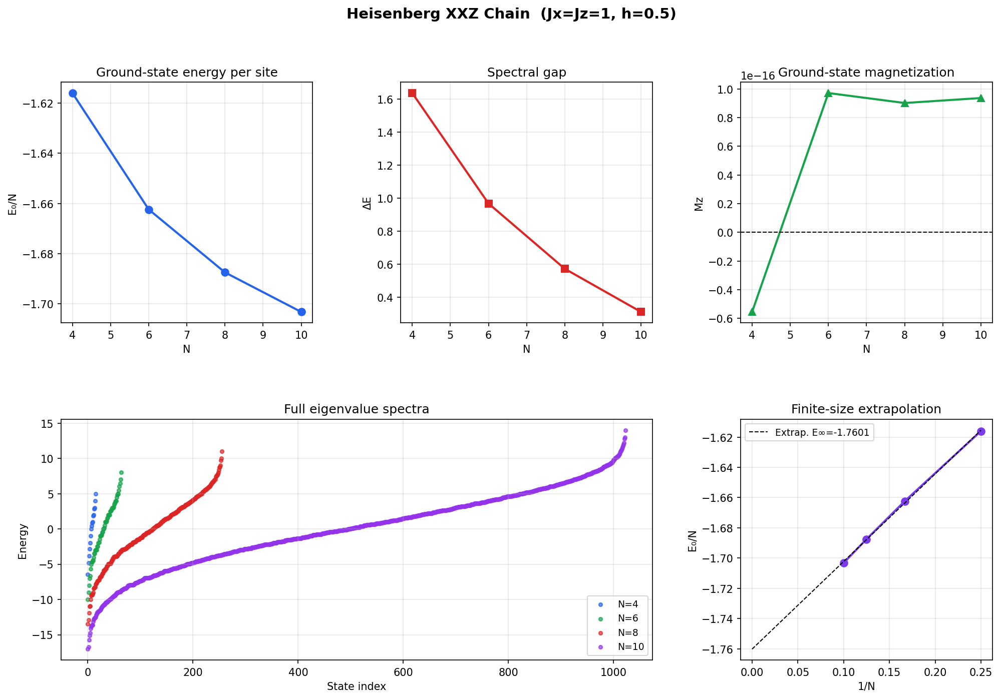
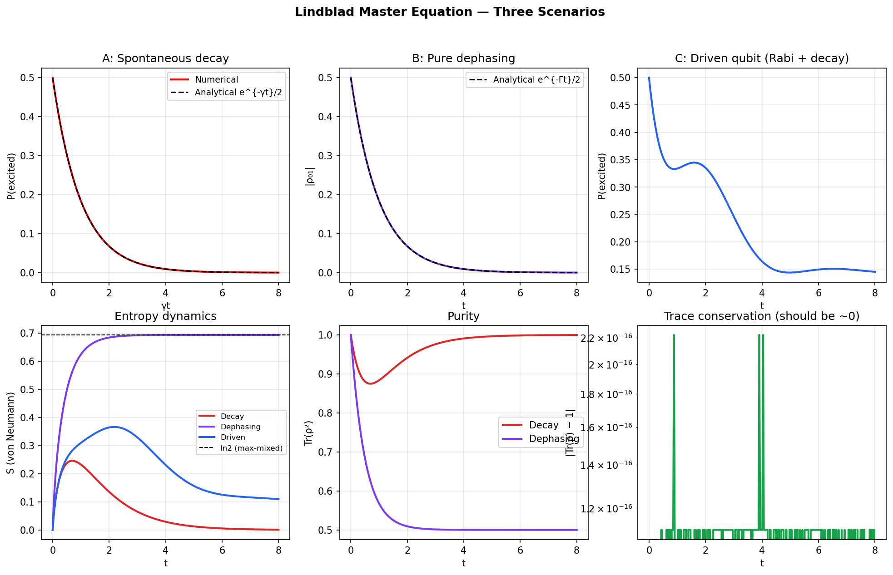
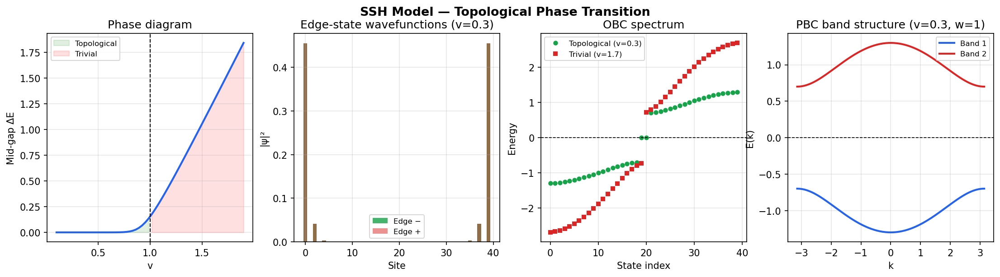
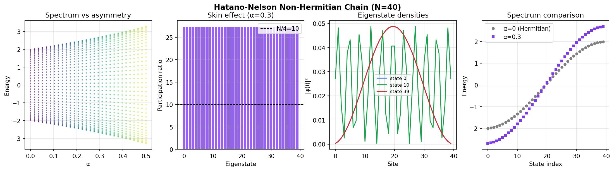
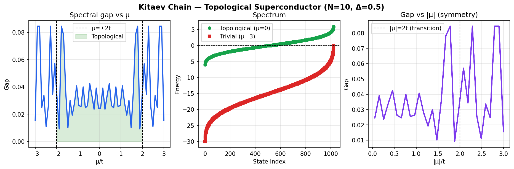
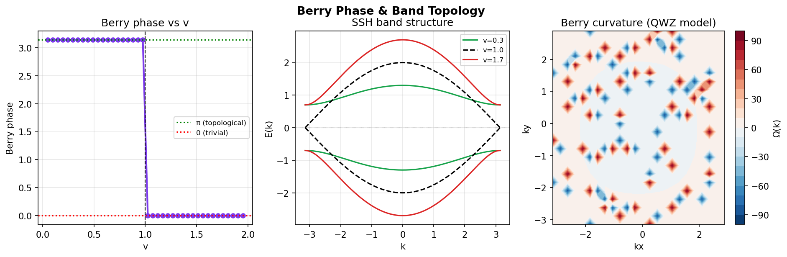
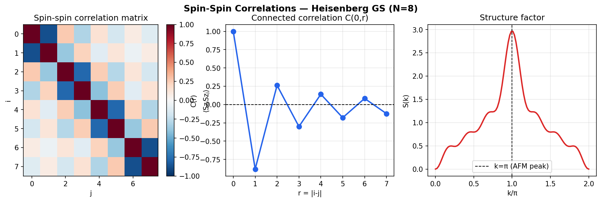
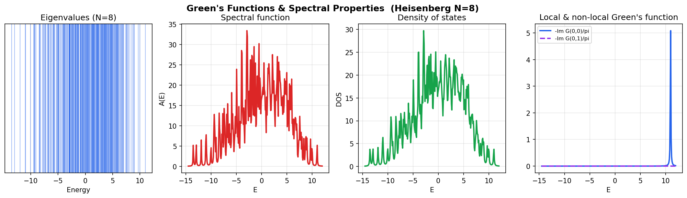

# QForge-ManyBody

**QForge-ManyBody** is an open-source Python framework for computational quantum many-body physics and open quantum systems.

The project provides a modular environment for implementing, testing, and extending numerical methods used in condensed matter physics, quantum statistical mechanics, and open quantum systems. It is designed for numerical experimentation, algorithm benchmarking, and reproducible scientific workflows.

[](https://www.python.org)
[](LICENSE)
[](#validation)

---

## Results

All 24 output plots are already saved in [`results/output/`](results/output/) — no need to run anything to see them.

Gallery images are in [`docs/images/`](docs/images/).

---

## Gallery

### Heisenberg XXZ Chain



### Lindblad Master Equation — Decay, Dephasing, Driven Qubit



### SSH Model — Topological Phase Transition



### Hatano-Nelson — Non-Hermitian Skin Effect



### Kitaev Chain — Topological Superconductor



### Berry Phase and Band Topology



### Spin-Spin Correlations and Structure Factor



### Green's Functions and Spectral Properties



---

## Features

### Numerical Methods

- Exact Diagonalization
- Lindblad Master Equation Dynamics
- RK4 Time Evolution
- Lanczos Solver
- Krylov Solver

### Quantum Models

- Heisenberg Spin Chain (XXX, XXZ)
- Transverse-Field Ising Model
- SSH Model
- Hatano–Nelson Model
- Kitaev Chain
- Hubbard Model (framework)

### Analysis

- von Neumann and Rényi entropy
- Spin-spin correlations and structure factor
- Fidelity and purity
- Berry phase and Chern number
- Green's functions, spectral function, DOS
- Bloch sphere visualization

---

## Repository Structure

```
QForge-ManyBody/
├── qforge/                 # Core Python package
│   ├── models/             # Heisenberg, Ising, SSH, Hatano-Nelson, Kitaev
│   ├── solvers/            # Exact diag, Lindblad, Lanczos, RK4
│   ├── open_systems/       # Lindblad solver class
│   ├── analysis/           # Entropy, correlations, fidelity, observables
│   ├── geometry/           # Berry phase, Chern number
│   ├── transport/          # Green's functions, spectral function, DOS
│   ├── physics/            # Spin operators, Pauli matrices
│   └── visualization/      # Spectrum plots, Bloch sphere
├── examples/               # Five runnable worked examples
├── papers/                 # Four self-contained paper reproductions
├── scripts/                # validate.py, benchmark.py, reproduce.py
├── results/output/         # 24 pre-computed output plots
├── docs/images/            # Gallery images
└── validation_results/     # benchmark_report.md, validation_report.md, summary.json
```

---

## Installation

**Step 1 — Clone**

```bash
git clone https://github.com/akshuattri/QForge-ManyBody.git
cd QForge-ManyBody
```

**Step 2 — Create environment** (recommended)

```bash
conda create -n qforge python=3.10
conda activate qforge
```

Or with venv:

```bash
python3 -m venv qforge_env
source qforge_env/bin/activate        # Linux / macOS
qforge_env\Scripts\activate           # Windows
```

**Step 3 — Install dependencies**

```bash
pip install -r requirements.txt
```

---

## Running the Code

> **Important:** QForge runs directly from the cloned directory — it is not installed as a package.
> All commands require `PYTHONPATH=.` so Python can find the `qforge/` module.
> `MPLBACKEND=Agg` saves plots to files instead of opening a GUI window — required on Linux servers, HPC clusters, WSL, and CI.

### Linux / macOS

```bash
# Reproduce all 24 result plots
MPLBACKEND=Agg PYTHONPATH=. python3 run_everything.py

# Run validation suite (14/14 checks)
MPLBACKEND=Agg PYTHONPATH=. python3 scripts/validate.py

# Run benchmarks
MPLBACKEND=Agg PYTHONPATH=. python3 scripts/benchmark.py

# Run individual examples
MPLBACKEND=Agg PYTHONPATH=. python3 examples/01_basic_usage.py
MPLBACKEND=Agg PYTHONPATH=. python3 examples/02_open_systems.py
MPLBACKEND=Agg PYTHONPATH=. python3 examples/03_ssh_topological.py
MPLBACKEND=Agg PYTHONPATH=. python3 examples/04_hatano_nelson.py
MPLBACKEND=Agg PYTHONPATH=. python3 examples/05_reproduce_paper.py

# Run paper reproductions
MPLBACKEND=Agg PYTHONPATH=. python3 papers/ssh_topological/reproduce.py
MPLBACKEND=Agg PYTHONPATH=. python3 papers/lindblad_dynamics/reproduce.py
MPLBACKEND=Agg PYTHONPATH=. python3 papers/nonhermitian_topology/reproduce.py
MPLBACKEND=Agg PYTHONPATH=. python3 papers/balducci_2026/reproduce.py
```

### Windows (PowerShell)

```powershell
$env:PYTHONPATH="."; $env:MPLBACKEND="Agg"; python run_everything.py
$env:PYTHONPATH="."; $env:MPLBACKEND="Agg"; python scripts/validate.py
$env:PYTHONPATH="."; $env:MPLBACKEND="Agg"; python scripts/benchmark.py
$env:PYTHONPATH="."; $env:MPLBACKEND="Agg"; python examples/01_basic_usage.py
```

### Windows (Command Prompt)

```cmd
set PYTHONPATH=. && set MPLBACKEND=Agg && python run_everything.py
set PYTHONPATH=. && set MPLBACKEND=Agg && python scripts/validate.py
```

---

## Validation

14/14 analytical checks pass:

```
A.  Exact Diagonalization
  [PASS]  2-spin dimer  E0           expected -3.0000      rel. err 0.00e+00
  [PASS]  2-spin dimer  gap (4J)     expected  4.0000      rel. err 0.00e+00
  [PASS]  4-spin chain  E0           expected -6.4641      rel. err 3.78e-14
  [PASS]  Hilbert-space dim (N=6)    expected 64           rel. err 0.00e+00

B.  Lindblad Master Equation
  [PASS]  Decay vs analytical        max |P_e - exact|     4.22e-07
  [PASS]  Trace preservation         max |Tr(rho) - 1|     2.22e-16
  [PASS]  Hermiticity                max |rho - rho†|      0.00e+00
  [PASS]  Steady state rho_00 -> 1   computed              0.9999999972

C.  SSH Topological Model
  [PASS]  Edge state |E_edge|        computed              3.17e-11
  [PASS]  Trivial phase gap > 0.5    computed              1.4470
  [PASS]  Phase boundary scaling     confirmed

D.  Physical Observables
  [PASS]  Ground-state Mz (h=0)      computed              2.78e-17
  [PASS]  Max-mixed entropy S=ln2    computed              0.6931471806
  [PASS]  Pure state entropy S=0     computed              0.00e+00

14/14 checks PASSED
```

Validation reports are pre-generated in [`validation_results/`](validation_results/).

---

## Example Output

```bash
MPLBACKEND=Agg PYTHONPATH=. python3 examples/01_basic_usage.py
```
```
Building Heisenberg Hamiltonian (N=8)...
Solving via exact diagonalization...
  E_0 = -13.49973039
  Gap =   0.57076844
Ground state energy: E_0 = -13.49973039
Magnetization: M_z = 0.000000
```

```bash
MPLBACKEND=Agg PYTHONPATH=. python3 examples/03_ssh_topological.py
```
```
SSH Model — Topological Phase Transition
  Topological gap  (v=0.3, w=1.0): 0.0000
  Trivial     gap  (v=1.7, w=1.0): 1.4370
  Edge-state energy (should ≈ 0) : 0.000000
```

```bash
MPLBACKEND=Agg PYTHONPATH=. python3 examples/04_hatano_nelson.py
```
```
Hatano-Nelson Non-Hermitian Model
  N = 40 sites,  α = 0.3
  Avg participation ratio : 27.33  (bulk ~ N/2 = 20)
```

---

## Paper Reproductions

| Paper | Model | Command |
|---|---|---|
| Su, Schrieffer, Heeger (1979) | SSH chain | `MPLBACKEND=Agg PYTHONPATH=. python3 papers/ssh_topological/reproduce.py` |
| Lindblad dynamics | Driven-dissipative qubit | `MPLBACKEND=Agg PYTHONPATH=. python3 papers/lindblad_dynamics/reproduce.py` |
| Non-Hermitian topology | Hatano-Nelson | `MPLBACKEND=Agg PYTHONPATH=. python3 papers/nonhermitian_topology/reproduce.py` |
| Balducci et al. (2026) | Open system topology | `MPLBACKEND=Agg PYTHONPATH=. python3 papers/balducci_2026/reproduce.py` |

---

## Roadmap

- Improved exact diagonalization algorithms
- Additional open quantum system solvers
- Quantum trajectory methods
- Expanded topological models
- Tensor-network interfaces
- Improved documentation and tutorials

---

## Contributing

Contributions, suggestions, bug reports, and discussions are welcome.

Please open an Issue or Pull Request on [GitHub](https://github.com/akshuattri/QForge-ManyBody).

---

## Citation

If you use QForge-ManyBody in academic work, please cite the repository.

```
Akshu Attri
QForge-ManyBody
https://github.com/akshuattri/QForge-ManyBody
2026
```

---

## License

MIT © 2026 — Akshu Attri
